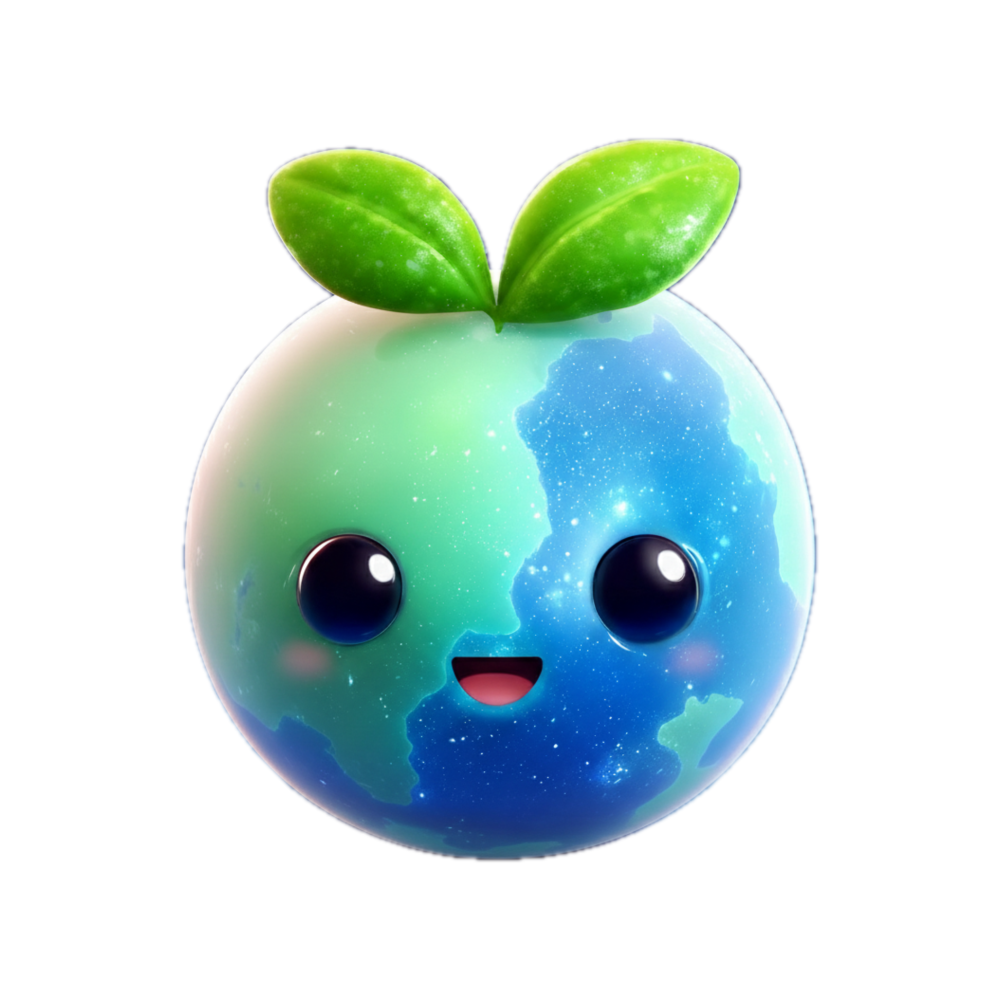
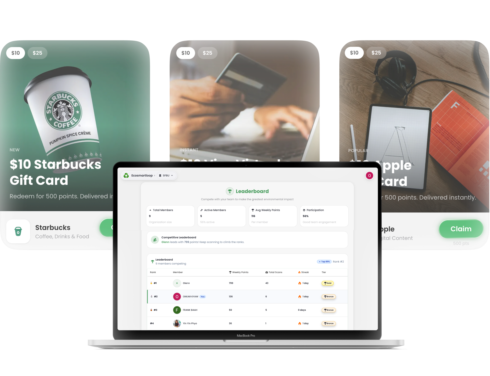
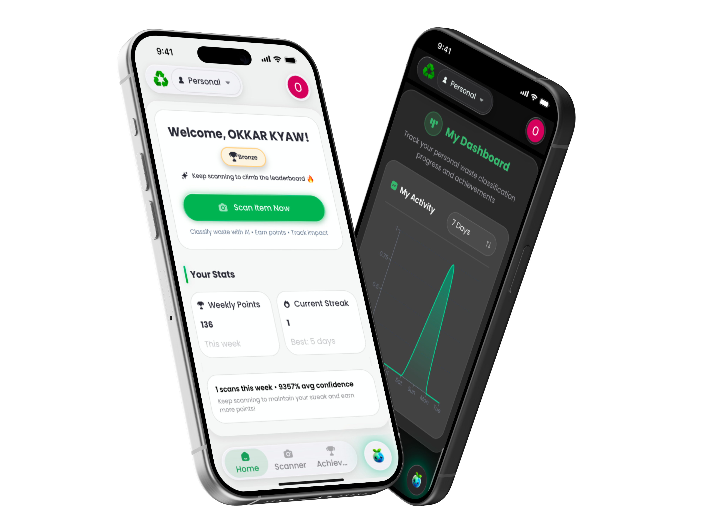

  

<h1 align="center">EcoSmartLoop</h1>
<h2 align="center">SCAN. LEARN. EARN. IMPACT.</h2>

  <b>AI-Powered Waste Intelligence Platform</b>

  <a href="#-why-we-built-this">Why</a> •
  <a href="#-see-it-in-action">Demo</a> •
  <a href="#-features">Features</a> •
  <a href="#-tech-stack">Tech Stack</a> •
  <a href="#-team">Team</a> •
  <a href="#%EF%B8%8F-what-weve-built">What We've Built</a> •
  <a href="#-connect-with-us">Connect</a>

  
  
  

---

## ✨ Why We Built This

**The Problem**: $640 billion in waste by 2050. But here's what we discovered: it's not from big mistakes. It's from small ones that compound.

You've stood in front of three bins. Trash. Recycling. Compost. And in that moment, you don't know which one. You guess. **8 out of 10 times**, people sort wrong. Small mistake. Multiply that by every business, every day, for decades. 

**California's Challenge**: SB 1383 mandates organic waste diversion, but **500,000+ California businesses** face fines and fees they don't expect. Not because they're careless. Because it's unclear. Universities, restaurants, offices, municipalities all dealing with the same "3-second hesitation" that costs them thousands in penalties, contamination fees, and lost recycling deductions.

**Our Solution**: EcoSmartLoop turns that moment of hesitation into a moment of clarity. AI-powered mobile scanning built in **4 months**, starting with California and designed to scale nationwide.

---

## 🎬 See It In Action

  
   
  <em>Real-time analytics and insights for organizations</em>

  
   
  <em>Point your phone at any waste item for instant classification</em>

---

## 💡 The Technology Behind It

  
   
  <em>LEAF Engine: Dual-core AI trained on 8,000+ real-world waste images</em>

**The Impact**:
- 🌍 **Instant Classification**: LEAF Engine identifies waste types in seconds with 95%+ accuracy using 8,000+ trained images (better than human waste experts)
- ♻️ **Compliance Made Simple**: Help California businesses avoid SB 1383 fines and contamination fees through real-time guidance
- 💡 **Smart Assistant**: Orbi AI provides personalized eco-tips with transparent reasoning ("Compost. Remove the lid.") for complete clarity in one moment
- 🎁 **Real Incentives**: Convert eco-achievements into gift cards from 2,000+ options with 78% monthly engagement vs. 12% industry average
- 🏢 **Scalable Architecture**: Designed to adapt to any organization (universities, corporations, municipalities, small businesses) with multi-tenant support and role-based intelligence

---

## 🚀 Features

### 📱 Waste Scanning & Classification

**Powered by LEAF Engine**: Our proprietary dual-core AI architecture delivers unmatched classification accuracy.

  
   
  <em>Point. Scan. Know instantly.</em>

**Key Capabilities**:
- ✅ **8,000+ Training Images**: Custom-trained model that self-improves daily
- ✅ **Instant Recognition**: Point your phone at any waste item and get immediate classification
- ✅ **Auto-Retrain Pipeline**: Continuous learning from new data to improve accuracy
- ✅ **Role-Aware Intelligence**: Personalized database insights based on user context

**Technical Highlights**:
- Custom Python-based ML model
- Real-time classification API
- Mobile-optimized inference
- Comprehensive waste category coverage

---

### 🤖 Orbi AI Assistant

**Your Personal Eco-Intelligence Guide**: Orbi AI is a context-aware assistant providing instant, conversational answers to all your recycling questions.

  
   
  <em>Ask anything about recycling and waste management</em>

**Key Features**:
- 🧠 **Model-Agnostic Architecture**: Powered by OpenAI, GPT, and Google Gemini
- 🎯 **System Prompt Optimized**: Specialized in waste cycling and sustainability expertise
- 🔧 **Tool Calling**: Dynamic UI rendering based on context
- 📚 **Search Integration**: Inline citations with expandable source modals

  
   
  <em>Transparent reasoning shows how Orbi reaches conclusions</em>

- 💭 **Transparent Reasoning**: See the AI's chain of thought process
- 💡 **Smart Suggestions**: Context-aware recommendations
- 🎮 **Interactive Quizzes**: Flip-card quizzes to test your eco-knowledge

  
   
  <em>Search with inline citations and expandable sources</em>

**Powered by**: Vercel AI SDK v5 with streaming responses

---

### 🎁 Gift Card Reward System

**Earn While You Learn**: Turn sustainable habits into tangible rewards!

  
   
  <em>2,000+ gift card options from top brands</em>

- ✅ **2,000+ Gift Card Options**: Choose from top brands through Tremendous API
- ✅ **Badge System**: Unlock achievements for consistent recycling
- ✅ **Streak Tracking**: Build habits with daily scanning streaks
- ✅ **Campaign Management**: Admins create custom reward campaigns

**Integration**: Tremendous API for seamless gift card delivery

---

### 🏆 Achievements & Leaderboards

**Gamification That Drives Impact**: Live leaderboards drive friendly rivalry between departments and organizations.

  
   
  <em>Track your eco-milestones and tier progression</em>

- ✅ **Personal Achievements**: Track your eco-milestones
- ✅ **Tier Progression**: Level up from Beginner to Eco-Champion
- ✅ **Organization Leaderboards**: Company-wide competitions

  
   
  <em>78% monthly engagement vs. 12% industry average</em>

- ✅ **Department Rivalry**: Inter-team challenges

**Impact**: Studies show gamification increases recycling participation by 40%

---

### 📊 Analytics & Insights

**Data-Driven Sustainability**: Comprehensive analytics for individuals and organizations.

  
   
  <em>Track your waste diversion impact in real-time</em>

- ✅ **Personal Dashboard**: Track your waste diversion impact
- ✅ **Organization Metrics**: Company-wide sustainability insights

  
   
  <em>Comprehensive organizational sustainability metrics</em>

- ✅ **Export Functionality**: Download reports for stakeholders
- ✅ **Real-Time Visualization**: Beautiful charts powered by modern web tech

  
   
  <em>Complete scan history with classification details</em>

**Starting in California**: Helping businesses comply with SB 1383 while avoiding fines and contamination fees. Designed to scale to any organization nationwide, from universities to municipalities to corporate offices.

---

### ⚙️ Admin Management

**Comprehensive Control Panel**: Full-featured admin dashboard for organization management.

  
   
  <em>User management with role-based access control</em>

- ✅ **User Management**: Add/remove users, assign roles
- ✅ **Analytics Oversight**: Monitor organization-wide metrics

  
   
  <em>Admin-level analytics and reporting</em>

- ✅ **Campaign Creation**: Design and launch gift card campaigns

  
   
  <em>Manage reward campaigns and gift card distribution</em>

- ✅ **Organization Profiles**: Manage company information

  
   
  <em>Organization management and configuration</em>

**Role-Based Access**: ADMIN and MEMBER roles with granular permissions

---

### 🎯 Architecture Highlights

**Four-Pillar System Design**

  
   
  <em>iOS, Android, and Web from single Next.js codebase via CapacitorJS</em>

**1. Vision & Audience**: Turning waste confusion into strategic intelligence for corporations, institutions, retail, and municipalities.

**2. Intelligence**: Dual-core AI architecture combining LEAF Engine (8,000+ images) and Orbi Agent (conversational AI) for unmatched accuracy.

**3. Growth Loop**: "SCAN. LEARN. EARN. IMPACT." The only behavioral loop that drives real change.

**4. Architecture**:
- 🏗️ **Unified Codebase**: iOS, Android, and Web from single Next.js codebase wrapped with CapacitorJS
- 🔐 **Bulletproof Security**: Zero-error type safety with TypeScript 100%
- ⚡ **Blazing Fast**: Edge deployment via Vercel with global CDN
- 🤖 **Automated CI/CD**: GitHub Actions for seamless updates

---

## 💻 Tech Stack

### Frontend

### Backend

### Database & Storage

### AI & Machine Learning

### Infrastructure

### Mobile

### Authentication & Payments

---

## 👥 Meet Our Team

<table>
  <tr>
    <td align="center" width="25%">
       
      <b>FNU NEELOFAR</b> 
      Frontend Developer & Data Analytics  
      
    </td>
    <td align="center" width="25%">
       
      <b>Frank Baah</b> 
      Backend Developer & LEAF Engine AI Training  
      
    </td>
    <td align="center" width="25%">
       
      <b>Glenn Marvin Musoke</b> 
      Backend Developer & LEAF Engine AI Training  
      
    </td>
    <td align="center" width="25%">
       
      <b>Okkar Kyaw</b> 
      Full-Stack Developer & Orbi AI Setup  
      
      
    </td>
  </tr>
</table>

---

## 🗺️ What We've Built

### ✅ Core Features Demonstrated

- [x] **LEAF Engine**: AI waste classification trained on 8,000+ real-world images
- [x] **Mobile-First Scanning**: Camera interface with instant classification
- [x] **Orbi AI Assistant**: Context-aware conversational AI with tool calling & reasoning
- [x] **Admin Dashboard**: User management and organization oversight
- [x] **Analytics & Insights**: Real-time sustainability metrics and export functionality
- [x] **Gamification System**: Gift card rewards (Tremendous API), achievements, and leaderboards
- [x] **Multi-Tenant Architecture**: Scalable to universities, corporations, and municipalities

### 🔮 What We've Planned

**If this project continues, these are the features we envision:**

- Android mobile app with same feature parity as iOS
- Public API for third-party waste management integrations
- Carbon footprint tracking with environmental impact visualization
- Community challenges and inter-organization competitions
- Enterprise SSO and advanced compliance reporting for large institutions
- Expanded geographic coverage beyond California with state-specific regulations

---

## 💬 Connect With Us

**This is a capstone project demonstration**: a proof of concept built to showcase how AI-powered waste intelligence can solve real compliance and sustainability challenges, starting with California's SB 1383.

While we won't be actively developing this project further, we're **open to collaboration and feedback**:

### Interested in This Project?

- 🏢 **For Organizations**: If you're a university, corporation, or municipality interested in implementing this solution or exploring partnership opportunities, reach out to our team via LinkedIn
- 💡 **For Developers**: Want to build something similar or use parts of this approach? Feel free to connect with us to discuss the architecture and lessons learned
- 🎓 **For Students/Researchers**: Curious about our AI training methodology, gamification strategy, or California compliance approach? We're happy to share insights
- 🤝 **For Investors/Advisors**: If you see potential in scaling this solution to tackle the $640B waste crisis, let's talk about what it would take to turn this demo into a real product

### Reach Out

Connect with our team members on [LinkedIn](#-meet-our-team) to discuss ideas, opportunities, or questions about the project.

---

  Made with ❤️ by the <a href="#-meet-our-team">EcoSmartLoop Team</a>

  <b>San Francisco Bay University | Capstone Project</b> 
  Project Advisor: Professor Ahmed Banafa | Department of Computer and Electrical Engineering

  Vercel, Next.js, and related marks are trademarks of Vercel, Inc. Amazon Web Services and AWS are trademarks of Amazon.com, Inc. or its affiliates. Google, Gemini, and related marks are trademarks of Google LLC.

